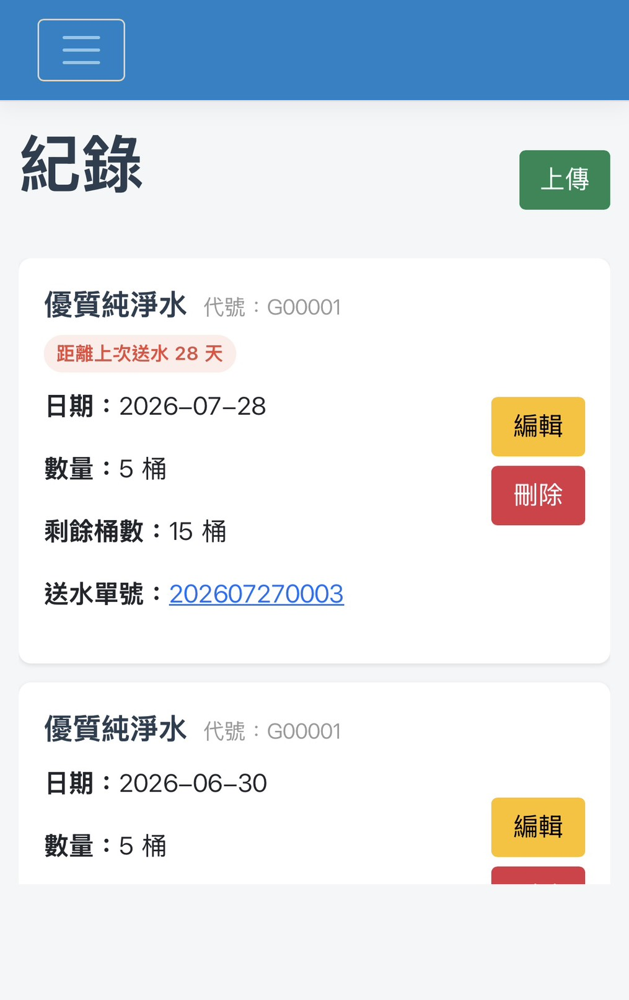
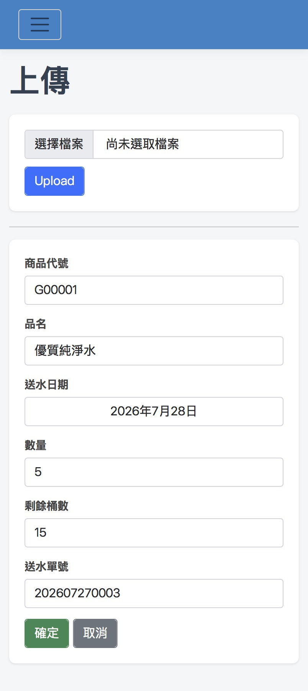
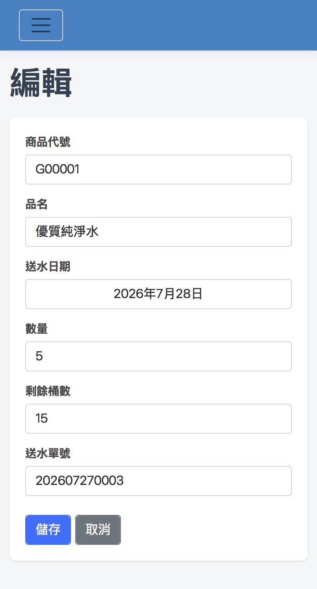
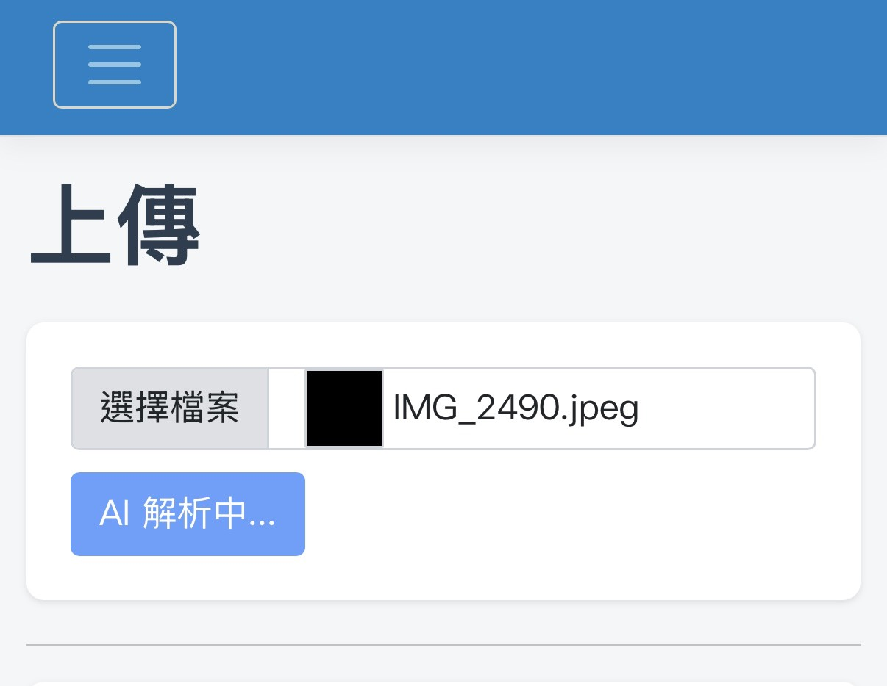
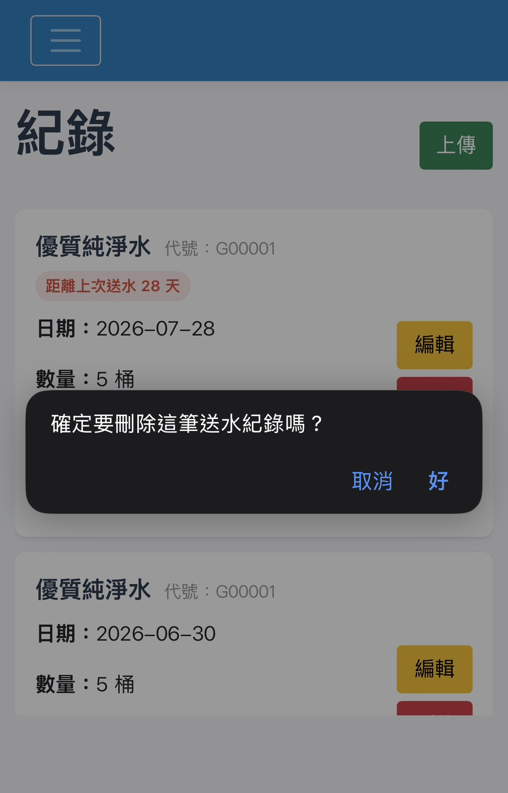
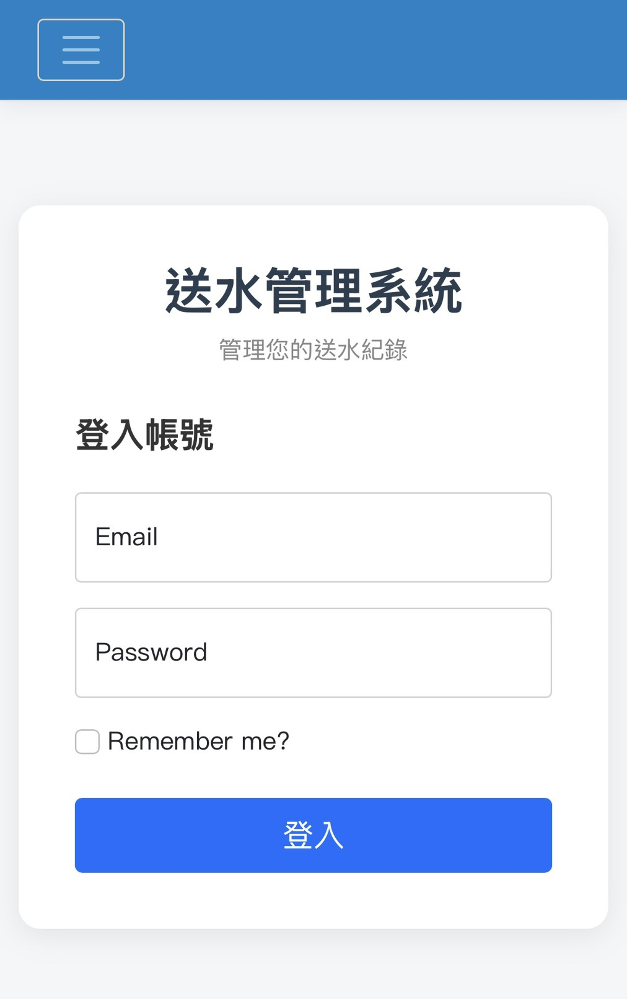
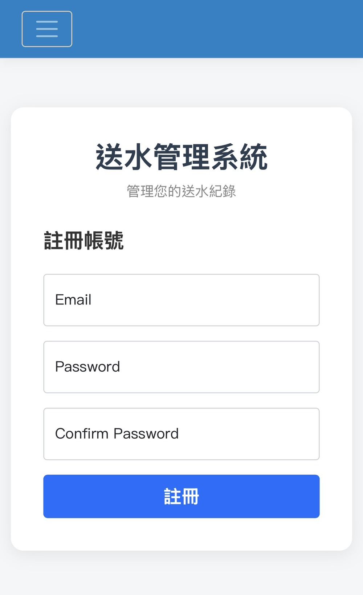

# WaterDeliveryInfo

一個使用 ASP.NET Core MVC 製作的桶裝水單據管理系統，支援使用者登入、送水紀錄管理。

---

## Demo

👉 [Live Demo][https://waterdelieveryinfo.onrender.com]

---

## Screenshots










## 部署注意事項 (Render Free Plan)

本專案部署於 Render 免費方案，由於平台限制，請留意以下行為：

*   **自動休眠**：若服務超過 **15 分鐘**未收到任何請求，Render 將會自動讓應用程式進入「休眠」狀態。
*   **冷啟動延遲**：當您在休眠後首次造訪網頁，會觸發**冷啟動（Cold Start）**。這可能導致約 **30 - 60 秒** 的連線延遲。

---

## 功能

- 🔐 使用者註冊 / 登入
- 📷 上傳送水單據圖片
- 🤖 使用 Gemini 分析單據內容
- ✏️ 編輯送水紀錄
- 🗑️ 刪除送水紀錄
- 📊 Record 查看歷史送水紀錄
- 📆 計算送水紀錄之間相隔天數差

---

## Tech Stack

- ASP.NET Core MVC (.NET 8)
- Entity Framework Core
- PostgreSQL (Neon)
- ASP.NET Identity
- Razor View
- Docker
- Google Gemini API
- Render（部署）

---

## Project Structure

```
WaterDeliveryInfo
│
├── wwwroot
├── Controllers
├── Data
├── Migrations
├── Models
├── Views
├── Services
├── Dockerfile
└── Program.cs
```

---

## Getting Started

### 1️⃣ Clone 專案
```bash
git clone https://github.com/Peter-Harker-Starling/WaterDelieveryInfo.git
cd WaterDelieveryInfo
```
### 2️⃣ 設定資料庫連線
```JSON
"ConnectionStrings": {
  "DefaultConnection": "資料庫連線字串"
},
"Gemini": {
  "ApiKey": "Google AI Studio ApiKey"
}
```
3️⃣ 套用資料庫 Migration
```bash
dotnet ef database update
```
4️⃣ 執行專案
```bash
dotnet run
```

---

## Note

透過此專案我學到：

- ASP.NET Core MVC 
- Entity Framework Core Migration
- ASP.NET Identity 
- PostgreSQL / Neon 雲端資料庫整合
- Docker 容器化
- Render 雲端部署
- Google Gemini 圖片辨識與資料解析
